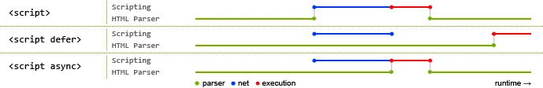

## 第一章：加载和执行

@(高性能JavaScript)

这一章讲述了 `JavaScript` 标签的位置和相对于位置所带来的影响，和我们平时书写代码的时候，`js` 标签放到哪里合适。

### 一丶线程互斥

在事件循环的那篇博客我们研究过浏览器的线程和进程问题，这里不再赘述。

用户界面的 `UI` 线程和 `js` 执行的引擎线程是互斥的。它们共用一个线程，所以在执行 `js` 代码的时候是不能渲染界面，在渲染界面的时候是不能执行 `js` 。同一时刻只能做一件事。

再简单点说，在一段 `html` 代码中，如果出现了 `<script>` 标签，那么浏览器会停止处理页面，先下载执行 `js` 代码，然后再继续解析和渲染页面。

因此，脚本在代码中的位置就很关键了。

### 二丶脚本位置

对于 `<script>` 标签的位置，是个老生常谈的问题，并且已经说的很清楚了。

如果把 `<script>` 放在 `<head>` 标签中，如果脚本加载时间过长，会有明显的延迟，会严重影响用户体验。

放在 `<body>` 的最后，因为这样不会影响页面的渲染，在 `js` 下载执行前，文档已经渲染完成了。

脚本放在底部依旧会阻塞其他脚本的下载和执行，**但是页面的大部分内容已经下载完成并显示给了用户**，所以再怎么折腾，用户也看不见，也就无所谓了。

### 三丶无阻塞脚本

`js`脚本文件的**下载和执行都会阻塞加载其他资源**。

其中**执行过程**是一定会阻塞`UI`渲染，无法解决的，只能将代码放到文档底部执行来“曲线救国”。

现在讨论的无阻塞，基本谈论的是 `js`的**下载过程**造成的阻塞，这个是可以解决的，有下面的几种方案

#### 1. 延迟脚本

HTML 4  为 `<script>` 定义了一个扩展属性： `defer`。

`defer`属性指明本元素所包含的脚本不会修改 `dom`，因此代码能安全的延迟执行，带有 `defer` 属性的 `<script>` 标签可以放置在文档的任何位置。**对应的 `JS` 文件将在页面解析到 `<script>` 标签时开始下载，但是并不会执行。**

**注意：**当一个带有 `defer` 属性的 `JavaScript` 文件下载时，它不会阻塞浏览器的其他进程，因此这类文件可以与页面中的其他资源**并行下载**

对于带有 `defer` 属性的 `<script>` 标签会在 `DOM` 加载完成后执行，也就是在 `DOMContentLoaded` 事件触发之前执行脚本。

如果有多个带 `defer` 属性的 `<script>` 标签，**它们不会按出现顺序下载，但是一定按出现顺序执行**，也就是在 `DOMContentLoaded` 事件之前，按照在文档中的先后位置，一个接一个执行。

看个例子

HTML
``` htmlbars
<html lang="en">
<head>
	<title>Document</title>
</head>
<body>
	<div id="box"></div>
	<div class="change">B</div>
</body>
<script type="text/javascript" src="./test2.js" defer></script>
<script type="text/javascript">
	console.log('内嵌');
</script>
<script type="text/javascript">
	document.addEventListener('DOMContentLoaded',function() {
		console.log('dom完毕')
	}, false);
</script>
</html>
```

test2

```javascript
console.log('test2');
```

在浏览器中运行的结果如下 

```
内嵌
test2
dom完毕
```

#### 2. 异步脚本

除了 `defer` 还有一个属性也可以做到延迟脚本，就是异步脚本 `async`

这个属性与`defer`类似，都用于改变处理脚本的行为。同样与`defer`类似，`async`只适用于外部脚本文件，并告诉浏览器立即下载文件。**但与`defer`不同的是，标记为`async`的脚本并不保证按照它们的先后顺序执行。**

`async` 实行的是**先下载完先执行**，它们不会放到最后执行，而是在**下载完之后立即执行**，所以如果下载完，dom 还没有解析完成，就会暂停解析，先执行脚本。所以这个属性对于我们用处不大，因为下载完成后，执行过程还是会造成阻塞，如果放到文档底部，那也没有必要并行下载了。是一个食之无味弃之可惜的属性。

`async` 和 `defer` 的区别我们看一张图就 ok 



蓝色线条代表的是脚本的下载，红色代表的是执行，绿色代表的 `html` 的解析

#### 3. 动态脚本元素

因为 `<script>` 是一个标签，所以我们可以通过 `js` 动态的创建 `<script>`标签，然后将标签添加到文档中。

这样做的目的就是使 `js` 的下载过程不阻塞其他资源的下载。

```javascript
let script = document.createElement('script');
script.type = 'text/javascript';
script.src = './test1.js';
document.getElementsByTagName('head')[0].appendChild(script);
```

这段代码应该是很熟悉了，因为在使用 `JSONP` 的时候，经常写。

使用动态脚本节点下载文件时，返回的代码通常会立刻执行，现在有些浏览器会等待此前所有**动态脚本节点执行完毕**后执行。

这个方法和`async`一样，没有什么太大的意义，执行还是会阻塞渲染的，所以都不如将 `<script>` 放到文档底部好使

#### 4. 对比

我们看一段代码，将各个脚本的执行事件理解一下

HTML

```
<html lang="en">
<head>
	<title>Document</title>
	<script type="text/javascript">
		let script = document.createElement('script');
		script.type = 'text/javascript';
		script.src = './test1.js';
		document.getElementsByTagName('head')[0].appendChild(script);
		console.log('动态加入位置');
	</script>
	<script type="text/javascript" src="./test2.js" defer></script>
	<script type="text/javascript" src="./test3.js" async></script>
	<script type="text/javascript">
		console.log('参考位置');
	</script>
</head>
<body></body>
<script type="text/javascript">
	document.addEventListener('DOMContentLoaded',function() {
	    console.log('dom完毕')
	}, false);

	window.addEventListener('load',function() {
	    console.log('load')
	}, false);
</script>
</html>
```

test1
```
console.log('s1位置');
```

test2
```
console.log('s2位置');
```

test3
```
console.log('s3位置');
```

这样一个网页执行后，控制台是这样的

```text
动态加入位置
参考位置
s2位置
dom完毕
s3位置
s1位置
load
```

可以看到，`defer` 在  **`dom`完毕** 之前执行，之后是 `async`和动态脚本下载完毕后的立即执行。

### 总结

对于 `js` 文件下载和执行阻塞页面渲染，有如下几种解决方式。

1. 将 `<script>` 标签置于文档底部，确保在脚本**下载执行前已经完成了渲染。**
2. 无阻塞脚本可以**让脚本文件的下载不阻塞渲染**，它主要有如下几种方法
	- 使用 `<script>` 的 `defer`属性
	- 使用 `<script>` 的 `async`属性
	- 动态创建 `<script>` 元素来下载并执行代码

其实在使用的时候，将 `<script>` 标签置于文档底部就已经足够了，放到底部首先不会阻塞其他资源(如图片，css)的加载，因为其他资源已经下载完毕了，其次执行也不会阻塞渲染，因为已经渲染完了。

如果想要一个脚本文件在所有其他脚本文件之后执行，可以使用 `defer` 属性，文档底部的脚本文件一定会在 `defer` 之前被执行。前提是其他脚本没有 `async` ，并且不是动态创建的。

至于 `async` 和动态创建，就显得很鸡肋了，它们只是让下载过程不阻塞，但是执行过程还是会阻塞，因此即使你使用了这两个方法，依旧要放到文档底部。但是文档底部又没有别的资源让你阻塞，所以用这两个方法又有什么用呢~


